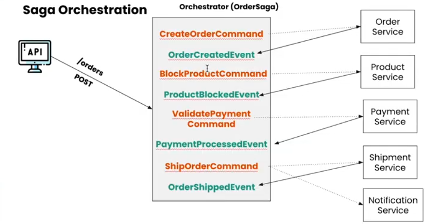
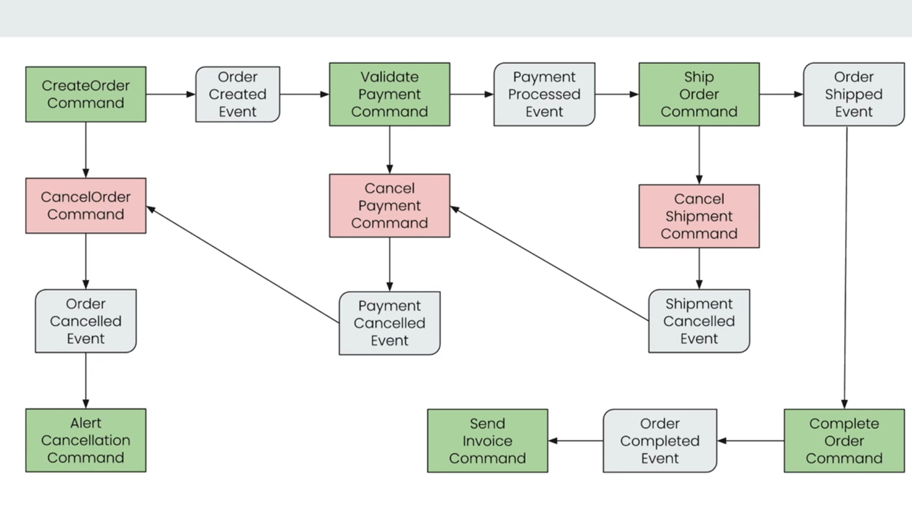

# SAGA Orchestration with Axon Framework

This repository demonstrates the implementation of the **SAGA Orchestration Design Pattern** in an Event-Driven Microservices Architecture using the Axon Framework. The system showcases coordinated business transactions (Sagas) spanning multiple microservices.
The system is resilient to failures by having compensatory transactions at each stage of the SAGA lifecycle.

## Architecture Overview

The platform consists of the following microservices:
- **Order Service**: Initiates and manages the saga lifecycle.
- **Payment Service**: Handles payment processing.
- **Shipment Service**: Manages shipment and delivery.
- **User Service**: Manages user information and authentication.
- **Notification Service**: Sends notifications about order status and updates.
- **Commons Package**: Contains shared classes, events, and utilities.

> **SAGA orchestration** is implemented in the Order Service, controlling the distributed transaction flow across all services.

### Architecture Diagram

  


## SAGA Process Flow

1. **Order Creation**: User places an order, which triggers the saga.
2. **Payment Processing**: Payment Service processes the payment.
3. **Shipment**: Upon successful payment, Shipment Service arranges delivery.
4. **Notification**: User receives status updates via Notification Service.
5. **Compensation**: If any step fails, the saga orchestrates compensating actions to maintain consistency.



## Getting Started

### Prerequisites

- Java 21+ (recommended)
- Maven or Gradle
- Axon Server (for event storage and messaging)
- Docker (for running services locally)

### Running the Services
Each microservice has its own separate database. Run the Axon server and the databases via Docker with the following command:

```bash
docker compose up -d
```
 The Axon server is available on port `:8084`.  

Each microservice is independently deployable. You can run them using your preferred IDE or via command-line tools.

```bash
mvn clean install
java -jar order-service/target/order-service.jar
java -jar payment-service/target/payment-service.jar
# ...repeat for other services
```

### Example: Placing an Order

To initiate a new order and start the saga, send a POST request to the Order Service:

**Endpoint:**  
`POST http://localhost:9091/api/v1/orders`

**Request Body:**
```json
{
  "productId": "123",
  "userId": "user_2",
  "addressId": "50",
  "quantity": 10
}
```

This triggers the SAGA workflow, coordinating actions across payment, shipment, and notification services.

## Technologies Used

- **Java**
- **Spring Boot**
- **Axon Framework**
- **Event Sourcing & CQRS**
- **RESTful APIs**
- **Docker** (optional)
- **Maven/Gradle**

## Project Structure

```
order-service/
payment-service/
shipment-service/
user-service/
notification-service/
commons/
static/
```

## TODO

A comprehensive list of technical TODOs is maintained in [TODO.md](./TODO.md).

### High-level tasks

- [ ] Handle runtime errors more gracefully throughout the application
- [ ] Create Dockerfiles for the command and query services
- [ ] Implement a CI pipeline to build Docker images and publish them to a container registry

## Contributing

Contributions and suggestions are welcome! Please open issues or pull requests for improvements.

## License

This project is open source under the [MIT License](LICENSE).

---

*Replace image links with the actual filenames in `static/` if they differ.*
